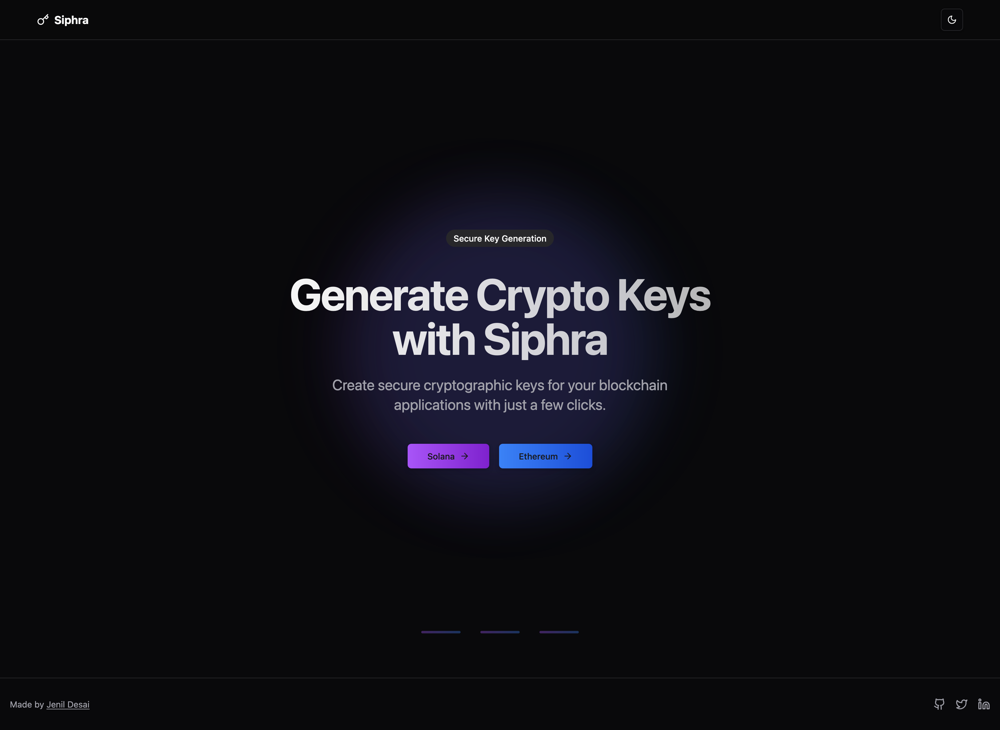
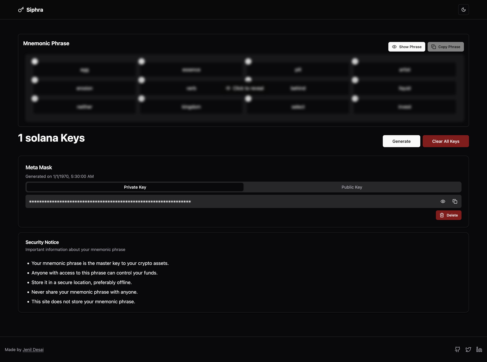

# 🔐 Siphra - Secure Key Generation Toolkit

**Siphra** is a lightweight, privacy-first tool for developers and blockchain enthusiasts to generate secure public-private key pairs and mnemonic passphrases. Built with modern web technologies, Siphra supports Solana and Ethereum keypair generation, fully client-side to ensure **zero data leaves your browser**.

> A utility designed for simplicity, speed, and security — without compromising privacy.

---

## 📑 Table of Contents

1. [Overview](#-overview)
2. [Tech Stack](#-tech-stack)
3. [Packages & Libraries](#-packages--libraries)
4. [Getting Started](#-getting-started)
5. [Setup](#-setup)
6. [Features](#-features)
7. [Demo & Screenshots](#-demo--screenshots)
8. [Acknowledgments](#-acknowledgments)
9. [License](#-license)

---

## 🌟 Overview

Siphra provides a streamlined UI for cryptographic operations commonly needed in blockchain and Web3 development. Whether you're preparing for a hackathon, testing DApp workflows, or just exploring how key generation works, **Siphra** gives you the tools you need, right in your browser.

- 🔒 No backend – everything stays local.
- ⚡ Generate mnemonic phrases and HD wallet keys.
- 🧩 Compatible with Solana and Ethereum.
- 🎯 Perfect for both beginners and experienced devs.

---

## 🧠 Tech Stack

| Layer        | Tech                             |
|--------------|----------------------------------|
| Framework    | Next.js (Typescript)             |
| Styling      | Tailwind CSS, Shadcn UI          |
| Runtime      | Bun.js                           |
| Storage      | Local browser storage (no backend) |

---

## 📦 Packages & Libraries

- `@solana/web3.js` – Solana SDK
- `ethers` – Ethereum wallet utilities
- `bip39` – Mnemonic phrase generation
- `ed25519-hd-key` – Hierarchical deterministic keys
- `zod` – Schema validation
- `jotai` – State management
- `uuid` – Unique ID generation
- `react-hook-form` + `@hookform/resolvers`
- `next-themes` – Light/dark mode support
- `sonner` – Toast notifications

---

## 🚀 Getting Started

> Prerequisites:
- Bun.js
- Git
- Node.js (optional if using Bun)
- IDE (WebStorm, VS Code, or Zed recommended)

---

## ⚙️ Setup

1. Clone the repository:
   ```bash
   git clone https://github.com/Jenil-Desai/siphra.git
   ```

2. Navigate to the project folder:

   ```bash
   cd siphra
   ```

3. Open in your IDE and install dependencies:

   ```bash
   bun install   # or npm/yarn/pnpm
   ```

4. Run the project:

   ```bash
   bun run dev
   ```

---

## 🎯 Features

* 🔑 **Generate Key Pairs**

  * Solana Keypair (Ed25519)
  * Ethereum Wallet (Ethers.js)

* 🧠 **Mnemonic Phrase Generator**

  * BIP39-compliant 12/24-word passphrases

* 🗃️ **Local-Only Storage**

  * All generated keys are stored **only** in the browser using localStorage
  * Nothing is sent to any server

* 🎨 **Modern UI**

  * Built with Shadcn UI and fully responsive

---

## 📸 Demo & Screenshots

Working demo available at [Siphra](https://siphra.vercel.app/)

|Home Page| Keypair Generator|
-------------------------------------|------------------------------------------
|  |  |

---

## 🙏 Acknowledgments

1. Harkirat Singh – Web3 Cohort-3 Assignment Inspiration
2. [Shadcn UI Documentation](https://ui.shadcn.dev/)
3. [Solana Web3.js Docs](https://solana-labs.github.io/solana-web3.js/)

---

## 📜 License

This project is licensed under the **MIT License**.

---

> Siphra – Because secure key generation should be simple, fast, and local.
